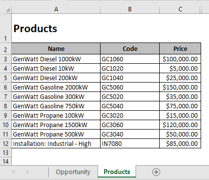

# About

>XLSX file is a Microsoft Excel Open XML Format Spreadsheet file.

Export XLSX file from a LWC with multiples worksheets and style.

No static resources, easy to change, just create a table and export to a file.

## Attention

This code will export a XML file that is only interpreted by a Microsoft Excel.

You can open the file and Save As another type and Microsoft Excel will automatically convert to a new XLS file.

The message that is shown when you open this type of file are always displayed, unless you Save As this file with another type.

>The File format and extension of 'filename.xls' don't match. The file could be corrupted or unsage. Unless you trust its source, don't open it. Do you want to open it anyway?

# Table of Contents
- [About](#about)
  - [Attention](#attention)
- [Table of Contents](#table-of-contents)
- [Microsoft Documentation](#microsoft-documentation)
- [References](#references)
- [How to use](#how-to-use)
  - [Get HTML table](#get-html-table)
    - [Using fixed HTML table](#using-fixed-html-table)
    - [Using backend dynamic table](#using-backend-dynamic-table)
- [Tips](#tips)
  - [Code](#code)
  - [Style](#style)
    - [Converting](#converting)
    - [One `<Style>` tag per HTML `<td>`](#one-style-tag-per-html-td)
    - [Using a XLSX file to create style](#using-a-xlsx-file-to-create-style)
- [How to corrupt your file](#how-to-corrupt-your-file)
  - [Should](#should)
  - [Shouldn't](#shouldnt)
- [HTML XLS Attributes](#html-xls-attributes)
- [Deploy and Test](#deploy-and-test)

# Microsoft Documentation

Here are Microsoft Documentation about all XML tags that we can use to export a XLSX file format:

- [XML in Excel and the Spreadsheet Component](https://learn.microsoft.com/en-us/previous-versions/office/developer/office-xp/aa140062(v=office.10))
- [XML Spreadsheet Reference](https://learn.microsoft.com/en-us/previous-versions/office/developer/office-xp/aa140066(v=office.10))

# References

These are my references about the code base that I'm using:

- [Question on Stack Overflow](https://stackoverflow.com/questions/29698796/how-to-convert-html-table-to-excel-with-multiple-sheet)
- [JSFiddle project](https://jsfiddle.net/qxLn3h86/48/)

This JSFiddle project guided me to understand how can I export a XML file that Excel can read and interprete.

I adapted this code to work with `Salesforce LWC`.

# How to use

Let's review the `export_example_opportunity` LWC:

 ```html
 <!-- table with lwc:ref  -->
 <table lwc:ref="opportunityTable">
 ...
 </table>
 ```

```javascript
// import export_xlsx LWC
import { exportXLSX } from 'c/export_xlsx';
```

```javascript
// return config about this component to export the file
// @api is only required if you want to a parent to export children components
// each structure of "config" is a new worksheet inside the file
@api
getXLSConfig(){
    return {
        table: this.refs.opportunityTable,  // table from lwc
        tabName: 'Opportunity',             // worksheet name
        displayGrid: true,                  // show or hide gridlines
        zoom: 120,                          // default zoom
        style: this.getXLSStyle()           // <Style> xml tags
    };
}
```

```javascript
// return <Style> tags for this component
getXLSStyle(){
    return `
        <Style ss:ID="o-default">
            <Alignment ss:Vertical="Center" ss:Horizontal="Left"/>
            <Font ss:Size="12" ss:FontName="Arial"/>
            <Borders>
                <Border ss:Color="#000000" ss:Weight="1" ss:LineStyle="Continuous" ss:Position="Top"/>
                <Border ss:Color="#000000" ss:Weight="1" ss:LineStyle="Continuous" ss:Position="Right"/>
                <Border ss:Color="#000000" ss:Weight="1" ss:LineStyle="Continuous" ss:Position="Bottom"/>
                <Border ss:Color="#000000" ss:Weight="1" ss:LineStyle="Continuous" ss:Position="Left"/>
            </Borders>
        </Style>
        <Style ss:ID="o-col" ss:Parent="o-default">
            <Font ss:Size="12" ss:FontName="Arial" ss:Bold="1"/>
            <Interior ss:Color="#bfbf67" ss:Pattern="Solid"/>
        </Style>
        <Style ss:ID="o-value" ss:Parent="o-default">
            <Interior ss:Color="#e0e0e0" ss:Pattern="Solid"/>
            <Alignment ss:Vertical="Center" ss:Horizontal="Left"/>
        </Style>
        <Style ss:ID="o-value-money" ss:Parent="o-default">
            <Alignment ss:Vertical="Center" ss:Horizontal="Right"/>
            <NumberFormat ss:Format="Currency"></NumberFormat>
            <Interior ss:Color="#e0e0e0" ss:Pattern="Solid"/>
        </Style>
    `;
}
```

```javascript
// handle click button
handleExport(){
    let config = new Array();

    config.push(this.getXLSConfig());

    // export the file
    exportXLSX(config, this.opportunity.Name);
}
```


## Get HTML table

### Using fixed HTML table

For fixed tables LWC .html file, you can use `lwc:ref`:

```javascript
<table lwc:ref="opportunityTable">

getXLSConfig(){
    ...
    this.refs.opportunityTable
}
```

### Using backend dynamic table

For dynamic tables LWC .js file, you can use `id`:

```javascript
<table id="dynamicTable"></table>

getXLSConfig()(){
    ...
    this.template.querySelector("#dynamicTable")
}
```

# Tips 

## Code

You need to create your HTML table as an Excel spreadsheet, considering each cell (rows and columns).

You can merge columns using HTML `colspan` default tag.

```html
<table lwc:ref="myTable">
    <tr>
        <td colspan="2">A</td>
        <td>B</td>
        <td>C</td>
    </tr>
    <tr>
        <td>1</td>
        <td>1.1</td>
        <td>2</td>
        <td>3</td>
    </tr>
</table>
```


## Style

### Converting

You can use your CSS to style your LWC but for export this LWC you need to convert this CSS to `<Style>` specific tags for XLSX, e.g:

>LWC .css
```css
.o-default{
    text-align: center;
    font-size: 12px;
    background-color: #e0e0e0;
    border: 1px solid;
}
```
you need to convert to:

>LWC .js
```html
<Style ss:ID="o-default">
    <Alignment ss:Horizontal="Center"/>
    <Font ss:Size="12"/>
    <Interior ss:Color="#e0e0e0" ss:Pattern="Solid"/>
    <Borders>
        <Border ss:Color="#000000" ss:Weight="1" ss:LineStyle="Continuous" ss:Position="Top"/>
        <Border ss:Color="#000000" ss:Weight="1" ss:LineStyle="Continuous" ss:Position="Right"/>
        <Border ss:Color="#000000" ss:Weight="1" ss:LineStyle="Continuous" ss:Position="Bottom"/>
        <Border ss:Color="#000000" ss:Weight="1" ss:LineStyle="Continuous" ss:Position="Left"/>
    </Borders>
</Style>
```

### One `<Style>` tag per HTML `<td>`

XLSX cannot accept more than one `<Style>` tag, you need to create a `<Style>` tag using `ss:Parent="parent-name"` attribute to inherit parent styles.

```html
<Style ss:ID="o-default">
    <Alignment ss:Vertical="Center" ss:Horizontal="Left"/>
    <Font ss:Size="12" ss:FontName="Arial"/>
</Style>
<Style ss:ID="o-col" ss:Parent="o-default">
    <Font ss:Size="12" ss:FontName="Arial" ss:Bold="1"/>
    <Interior ss:Color="#bfbf67" ss:Pattern="Solid"/>
</Style>
```

You can use `export_example_opportunity.js` / `export_example_products.js` `getXLSStyle()` function as example to export `<Style>` tags.

You can check all style tags from [Microsoft Documentation](#microsoft-documentation).

### Using a XLSX file to create style

You can use the [Empty file](./assets/Empty.xls) to create all your styles tags, just open the empty file and define all styles that you want, save it, and open this file with a text editor to check the styles that Microsoft Excel automatically created, copy and paste to your code and it's done.

# How to corrupt your file

XML file is sensitivity and will corrupt if something is wrong.

## Should

- create your HTML table as an excel file, with the same number of rows and columns
- create `<Style>` tag for all that you're referecing in your html `data-xls-style` tag
- create `<Style>` with a specific name for each LWC that you want to export (e.g apply some name before: `o-` for opportunity LWC and `p-` products LWC)

## Shouldn't

- export more than once the same name for `<Style ss:ID="">`
- export undefined values
- break values/lines inside `<td>` html tag
- use specific html tags such as:
    - `<hr>`
    - `<br>`

# HTML XLS Attributes

|Tag|Description|
|-|-|
|data-xls-style|`ss:ID` of the XML Style - only one per html tag|
|data-xls-type|Type of value - `Number/DateTime/Boolean/String`|
|data-xls-value|Value to export, if blank will use same value inside `<td>` html tag|
|colspan|HTML default tag - used to merge horizontal cells|

# Deploy and Test

starting clonning the repository
```bash
git clone https://github.com/jvaloto/export-lwc-to-xlsx.git
```

access repository folder
```bash
cd export-lwc-to-xlsx
```

deploy project to Salesforce
```bash
sf project deploy start -o your_org_alias
```

assign permission set to your user
```bash
sf org assign permset -n Export_example_LWC -o your_org_alias
```

Search for `Export LWC` tab

You can export individual files or export tables to a single file using parent children LWC


